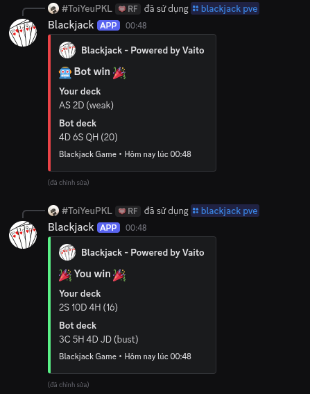
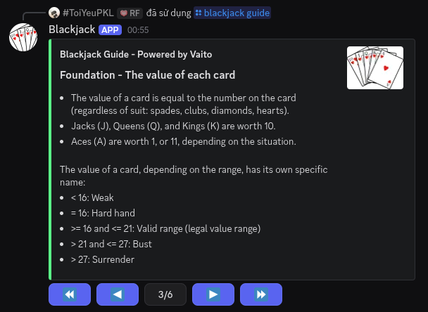
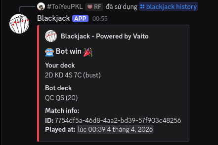

# Python Blackjack
A simple Blackjack bot written in Python with [Hikari](https://www.hikari-py.dev/), [Arc](https://arc.hypergonial.com/) and [Miru](https://miru.hypergonial.com/).

## I. Setup & Start the bot
To setup enviroment, install packages with this command:
```bash
uv sync
```

Then run this command follow its instruction:
```bash
python cli.py setup
```

For more options, run:
```bash
python cli.py setup --help
```

After set up the environment, run this command:
```bash
python cli.py start
```

### II. Commands:

These are available commands:

| Name               | Description             |
|--------------------|-------------------------|
| /ping              | Get bot's lattency      |
| /blackjack guide   | Show a guide to play BJ |
| /blackjack pve     | Play Blackjack with bot |
| /blackjack history | Show your history       |

### III. Demo:







### IV. Environment:

| Name | Data type | Required | Note |
|------|-----------|----------|------|
|DB_URL| string    | ✅       |Must include async driver of the DB (eg. aiosqlite for SQLite) and Must be accepted by SQLAlchemy|
|TOKEN | string    | ✅       |      |

### V. Components

| Library | Purpose           | Note |
|---------|-------------------|------|
| Hikari  | Main bot          |      |
| Arc     | Command handler   |      |
| Miru    | Component handler |      |
| Click   | CLI               |      |
